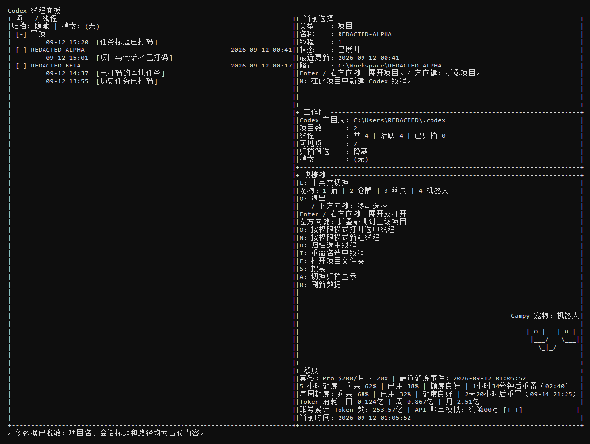

# Codex Thread Panel

一个面向 Windows 的 Codex 本地线程面板。它把 Codex CLI 的恢复、创建和管理能力放进一个轻量终端 UI：快速浏览项目和会话、从本地直接恢复指定线程、查看桌面端同源的置顶状态与账号额度。

> 面向的场景：当 Codex Desktop 里累积了许多长期任务时，切换或浏览任务可能变慢、键盘导航也不够轻快。这个项目不是替换桌面端，而是提供一个与本机 Codex 数据关联的 CLI 面板，把高频“找任务、恢复任务、开新任务”的动作留在更轻的终端界面里。




以上截图由当前面板的真实渲染代码生成，使用虚构的 `REDACTED` 项目、路径和会话标题；不含任何真实本机项目数据。

## 它解决什么

- **启动列表不读全部聊天内容。** 正常情况下优先读取 `state_5.sqlite`、`session_index.jsonl` 与桌面端置顶清单，只读取会话索引元数据来绘制项目树；只有索引都不可用时，才受限回退扫描 session JSONL。
- **数据变更才刷新。** 面板每 5 秒检查状态库、WAL、索引和置顶配置的元数据；无变更就保留当前列表和选中项，不反复重新解析历史会话。
- **恢复任务更直接。** 选中会话后即可打开新的可见终端并执行 `codex resume`，同时继承该会话记录的模型和 reasoning effort。
- **显示和 Desktop 一致的归属信息。** 标题优先使用桌面端的正式命名来源；置顶列表来自 Desktop 的全局置顶清单，置顶会话不会在所属项目下重复显示。
- **一屏看额度与 Token。** 显示套餐、5 小时/周额度健康度、日/周/月 Token 消耗和账号累计 Token；账号统计优先来自本地已登录 Codex 的 `app-server` 只读接口。

## 快速开始

前提：Windows、已安装 Node.js，以及可以在 PowerShell 中执行 `codex` 的已登录 Codex CLI。

```powershell
git clone https://github.com/fehuing/codex-thread-panel.git
cd codex-thread-panel
.\Start-CodexThreadPanel.cmd
```

项目没有 npm 依赖，**不需要** `npm install`。想用更大的终端窗口时运行：

```powershell
.\Start-CodexThreadPanel-Maximized.cmd
```

建议的终端最小尺寸是 92 列 x 26 行；窗口更高时会展示完整快捷键说明和右下角宠物。

## 常用操作

| 按键 | 操作 |
| --- | --- |
| `L` | 中英文界面切换 |
| `Up` / `Down` | 移动选择 |
| `Left` | 折叠，或从会话回到所属项目 |
| `Right` / `Enter` | 展开项目或恢复选中的会话 |
| `N` | 在当前项目创建新会话 |
| `T` | 重命名选中的会话 |
| `D` | 归档选中的会话 |
| `F` | 打开当前项目文件夹 |
| `S` | 搜索 |
| `A` | 显示/隐藏已归档会话 |
| `R` | 刷新本地数据 |
| `1` / `2` / `3` / `4` | 切换 Campy 猫 / 仓鼠 / 幽灵 / 机器人 |
| `Q` | 退出 |

处于权限选择界面时，`1` 至 `4` 保持为权限模式选择，不会切换宠物。

## 额度与 Token

额度区读取账户全局的 `codex` 限额事件，避免模型专属额度覆盖全局数据。额度颜色会同时考虑剩余额度和距离重置的时间：绿色表示进度健康，橙色表示消耗偏快，红色表示需要留意。

账号 Token 数据优先调用本机 Codex 安装自带的 `app-server` 的只读 `account/usage/read`。它只使用现有登录状态读取统计，不保存登录凭据，也不会修改账户；接口暂时不可用时才回退到本地 session JSONL 汇总。累计 Token 后的 API 金额是调侃性质的粗略等价估算，不是账单。

## 数据与隐私

- 所有项目树、标题、归档和置顶状态均从本机 `%USERPROFILE%\.codex` 读取。
- 打开或新建会话时，面板只是在本机启动一个新的 Codex CLI 终端。
- 面板不需要额外 API Key，不上传会话内容，也不引入跨线程桥接服务。
- 重命名与归档会写入本机 Codex 状态库；其他列表和额度读取均为只读。

## 主要文件

- `CodexThreadPanelTui.js`：Node.js 终端 UI、线程索引、渲染、快捷键与额度读取。
- `Start-CodexThreadPanel.cmd`：默认启动入口。
- `Start-CodexThreadPanel-Maximized.cmd`：最大化终端入口。
- `Rename-CodexThread.ps1`：Unicode 安全的标题同步辅助脚本。
- `PROJECT_ANALYSIS.md`：实现、性能和数据来源的分析记录。
- `THIRD_PARTY_NOTICES.md`：Campy ASCII 宠物帧的来源及 MIT 许可说明。

## 验证

```powershell
node --check .\CodexThreadPanelTui.js
node --no-warnings .\CodexThreadPanelTui.js --check
git diff --check
```

## 第三方声明

右下角的四组 Campy 闲置 ASCII 宠物帧来自 [`dropdevrahul/campy`](https://github.com/dropdevrahul/campy) 的 MIT 许可源码；项目未安装 Campy，也不接入其 MCP、hook 或自动配置能力。完整版权和许可见 [THIRD_PARTY_NOTICES.md](THIRD_PARTY_NOTICES.md)。
